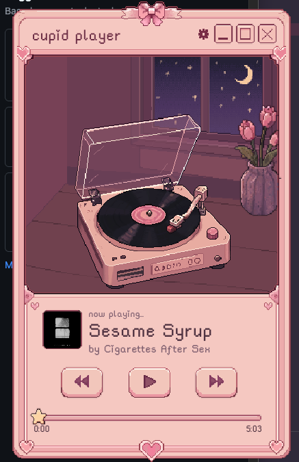
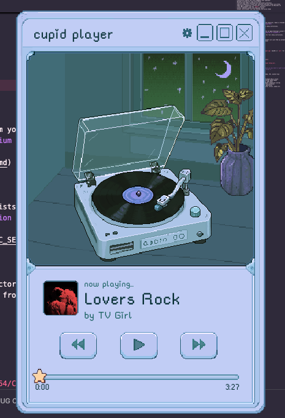

# cupid player

A pixel-art desktop music player built with Electron, Vite, and React.

<p>
  
  
</p>

## Features

- Pixel-art UI with animated record player, spinning vinyl, and needle
- Record swap animation on song change (pink/blue vinyl alternation)
- Interactive progress bar with draggable star indicator
- Marquee scrolling for long track titles
- Pink and blue theme switching with persistent preference
- Spotify integration — browse your playlists and play tracks via yt-dlp
- Apple Music integration — browse your library playlists via MusicKit JS
- YouTube playlists — paste any public playlist URL (no sign-in) or sign in with Google to browse your own
- Local MP3 playback from the `audio/` directory
- Custom frameless window with drag and resize
- Dynamic dock/taskbar icon that matches the active theme

## Getting Started

One command sets everything up:

```bash
npm run setup
npm run dev
```

`npm run setup` installs dependencies, downloads the yt-dlp binary, and automatically checks for and repairs the Electron binary issue that can otherwise break `npm run dev` on Windows — so there's nothing to troubleshoot by hand. If anything was off, just re-run `npm run setup`.

Requires Node.js 18+ (**24.x LTS recommended**). No Python install needed — setup fetches the standalone yt-dlp binary that powers streaming.

> Hitting an Electron `path.txt` / "failed to install correctly" error, or streaming not working? See [TROUBLESHOOTING.md](TROUBLESHOOTING.md) — including the manual Electron binary fix for too-new Node versions.

## Spotify Setup

Cupid Player can stream any track from your Spotify playlists. Audio is fetched from YouTube via yt-dlp.

> **Note:** As of February 2026, Spotify requires the developer account that creates the app to have an active Premium subscription ([announcement](https://developer.spotify.com/blog/2026-02-06-update-on-developer-access-and-platform-security)). Without it, the Spotify API returns 403 for all users.

See [SPOTIFY_SETUP.md](SPOTIFY_SETUP.md) for full setup instructions.

## Apple Music Setup

Browse your Apple Music library playlists. Requires an Apple Developer account for the MusicKit key. **Apple Music subscription is not required for playback.**

See [APPLE_MUSIC_SETUP.md](APPLE_MUSIC_SETUP.md) for full setup instructions.

## YouTube Setup

Two flows: paste any public playlist URL (no sign-in required) or sign in with Google to browse your own playlists. **No YouTube Premium / no subscription required** in either case — and the URL-paste flow needs no setup at all.

The sign-in-with-Google option only appears in the settings panel when `VITE_YOUTUBE_CLIENT_ID` (and `VITE_YOUTUBE_CLIENT_SECRET`) are set in `.env`. Without those, the panel shows the URL-paste box instead — pick whichever flow you want by configuring (or not configuring) your `.env`.

See [YOUTUBE_SETUP.md](YOUTUBE_SETUP.md) for full setup instructions.

## Adding Local Audio Files

The local playlist is driven by a single file, `playlist.json`, that lives next to your audio files. Drop your songs into the audio folder, list them in the JSON, and the player picks them up.

### Where the audio folder lives

- **Running from source (dev):** `audio/` in the project root.
- **Installed app (macOS):** `~/Library/Application Support/Cupid Player/audio/`
- **Installed app (Windows):** `%APPDATA%\Cupid Player\audio\`
- **Installed app (Linux):** `~/.config/Cupid Player/audio/`

On first launch, the installed app seeds this folder with the bundled defaults. After that it's yours to edit — the app never overwrites it.

### Building your playlist

1. Drop `.mp3` files into the audio folder.
2. Open `playlist.json` in the same folder and add one entry per song:

   ```json
   [
     { "file": "my-song.mp3", "title": "My Song", "artist": "Some Artist", "album": "Album Name", "art": "https://example.com/cover.jpg" },
     { "file": "another.mp3", "title": "Another Song", "artist": "Someone Else" }
   ]
   ```

   - `file` and `title` are required.
   - `artist`, `album`, and `art` are optional. `art` is a URL to a cover image.
   - The `file` value must match the mp3 filename exactly (spaces and case included).

3. In the app, hit the settings icon and the local tab is selected by default. Reload the app to pick up new edits — `playlist.json` is read on launch.

### Supported formats

`.mp3`, `.m4a`, `.aac`, `.flac`, `.wav`, `.ogg`, `.opus`.

## Build

```bash
npm run package
```

The built app will be in `out/mac-arm64/Cupid Player.app` (macOS) or `out/` for other platforms.

### Install as Desktop App

**macOS:**
```bash
cp -r "out/mac-arm64/Cupid Player.app" /Applications/
```

**Windows:** Run the installer from `out/Cupid Player Setup.exe`. If `npm run package` fails at the NSIS step with "Cannot create symbolic link," enable **Developer Mode** in Settings → System → For developers, then re-run. The unpacked app at `out/win-unpacked/Cupid Player.exe` is fully runnable in the meantime — no installer required.

**Linux:** Run the AppImage from `out/`.

> Note: The macOS build is unsigned. On first launch you may need to right-click > Open, or go to System Settings > Privacy & Security to allow it.

## Tech Stack

- **Electron** — desktop app shell (frameless window, IPC, system tray)
- **Vite** — build tool and dev server
- **React** — UI framework
- **HTML5 Audio** — local MP3 playback
- **yt-dlp** — YouTube audio streaming for Spotify/Apple/YouTube tracks; also fetches public YouTube playlist contents via `--flat-playlist`
- **Spotify Web API** — playlist and metadata fetching (OAuth PKCE)
- **Apple MusicKit JS** — library playlist access (JWT auth)
- **YouTube Data API v3** — sign-in browsing of the user's own playlists (Google OAuth PKCE, free quota)
- **CSS** — custom properties for theming, calc-based responsive scaling
- **Node.js** — main process (JWT generation, yt-dlp execution)
- **jsonwebtoken** — Apple Music developer token generation
- **music-metadata** — MP3 ID3 tag extraction (title, artist, album art)
